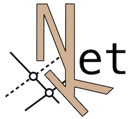

# 
# __NetKet__ 

NetKet is an open-source project delivering cutting-edge methods for the study
of many-body quantum systems with artificial neural networks and machine learning techniques.

# Major Features

* Graphs
  * Built-in graphs
    * Hypercube
  * Custom graphs
    * Any graph with given adjacency matrix [from input file]

* Hamiltonians
  * Built-in hamiltonians
    * Transverse-field Ising
    * Heisenberg
  * Custom Hamiltonians
    * Any k-local Hamiltonian [from input file]

* Learning
  * Steppers
    * Stochastic Gradient Descent
    * AdaMax
  * Ground-state learning
    * Gradient Descent
    * Stochastic Reconfiguration Method

* Machines
  * Restricted Boltzmann Machines
    * Standard
    * For Custom local Hilbert spaces
    * With Permutation Symmetry
  * Custom Machines
    * Any machine satisfying prototype of abstract machine [extending C++ code]

* Observables
  * Custom observables
    * Any k-local operator [from input file]

* Sampling
  * Local Metropolis moves
    * Local Hilbert space sampling
    * Parallel tempering versions
  * Hamiltonian moves
    * Automatic moves with Hamiltonian symmetry
    * Parallel tempering versions

* Statistics
  * Automatic estimate of correlation times

* I/O
  * Python/JSON interface   

Please visit our [homepage](www.netket.org) for further information.

# License

[Apache License 2.0](https://github.com/netket/netket/blob/master/LICENSE)
